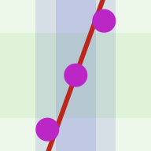

## Statistic

Statisticは,統計のイメージを掴むための簡単なおもちゃです。

[Statistic を開く](https://akimikimikimikimikimikimika.github.io/Statistic/Statistic.html "Statistic")  

[ソースコード](https://github.com/akimikimikimikimikimikimika/Statistic/ "ソースコード")

### 基本
- XYグラフ上で点をプロットしていくにつれ変化する統計量を触って体感する。
- -1≤x≤1,-1≤y≤1 の範囲を表示する。
- マウスでクリック又はタッチすることで点をプロットする。すでにプロットした点も移動させることができる。
- 画面右下のボタンを押すとメニューが表示され,そこから各種機能を呼び出せる。

### 統計量の表示

- 緑,青の領域によって,プロットした点のX方向,Y方向それぞれの傾向を表示する。
- 数点プロットすると分散傾向を表す楕円が表示される。
- その他,メニューから追加できる回帰直線などをオンにして表示する。

### メニュー内のボタン
- “CS” (S) : 外観モードの切り替え (ライト/ダーク)
- “HT”,“SV”,“CV” (W) : 描画モードの切り替え
	* 現在のモードに合わせてボタンラベルが切り替わる
	* HT : HTML で描画しています
	* SV : SVG で描画しています
	* CV : Canvas 2D で描画しています
- “CL” (C) : 現在プロットされている点を全て削除
- “SQ” (Q) : 正方形表示のオン/オフ
	* オフの場合,ビューポートのサイズに合わせてグラフの縦横それぞれを伸縮させる。
	* オンの場合,ビューポートに収まるサイズの正方形でグラフを表示する。
	* 本来, x,y の値域は等しいので,そのことを強調するためにオンにした方が見やすい場合がある。
- “X” (X) : x軸方向の分散の表示/非表示
- “Y” (Y) : y軸方向の分散の表示/非表示
- “σ”, “AD”, “Q” (A) : 領域の表示モードの切り替え
	* X軸,Y軸方向の表示における表示モードが切り替わる。
	* 現在のモードに合わせてボタンラベルが切り替わる
	* それぞれのモードの違いは後述
- “PC” (P) : 主成分の表示/非表示
- “X-Y” (D) : xを説明変数,yを目的変数とした回帰直線の表示/非表示
- “Y-X” (G) : yを説明変数,xを目的変数とした回帰直線の表示/非表示
- “OV” (O) : 多変量正規分布に基づく楕円の表示/非表示
- “B”, “UB” (B) : 分散として通常の分散か不偏分散かを切り替える  
	UBの時に不偏分散が適用される
- “⚀” (R) : ランダムに指定した座標の点を1つ追加
	* 一様分布に従う乱数で平面上の追加点の座標を決定する。
- “N ⚀” (N) : ランダムに指定した座標で点を1つ追加
	* 正規分布に従う乱数で平面上の追加点の座標を決定する。  
	* 正規分布における平均値は 0 ,標準偏差は 1/3 となるよう調整している。
- “×” : メニューを閉じる

### 領域のモード

緑はX方向,青はY方向に関して,それぞれ中心線と,その周りの2つの外郭領域によって特徴量をグラフ上で示している。
#### σ : 標準偏差  
中心線は平均値 `μ` で,その周りに,標準偏差 `σ` により, `μ±σ` , `μ±2σ` で表される領域が表示される。
#### AD : 平均値に対する絶対偏差の平均  
σの時と同様に表示されるが,この場合,標準偏差 `σ` の代わりに,各々の点に関して平均値からの偏差の絶対値をとり,それらを平均して得た値を採用する。
#### Q : 四分位範囲  
最大値,最小値に挟まれた領域と,四分位範囲を表す領域を表示する。中心線は中央値になる。

### 直線

#### PC : 主成分ベクトル方向の直線
プロットした点から算出される主成分ベクトルに平行な直線を表示する。ベクトル方向の寄与率に基づいて直線の色の濃さが変化する。  
平面上における主成分は一般に2つ存在し,互いに垂直である。  
ある方向に各点を並べた際に,最も分散が大きくなる方向と小さくなる方向がある。平面上ではこれらが2つの主成分となる。  
プロットした点の特徴がどれほど現れているかを示す指標は寄与率と呼ぶ。  
色の濃い直線の方向にプロットした点の特徴が最もよく現れ,薄い方向に最も現れにくい。  
両直線はプロットした点の平均の点を通るようにしている。
#### X-Y : Xを説明変数,Yを目的変数とした時の,線形回帰直線  
最小2乗法によりプロット点から予測される,Xに対するYの線形的関係を表す。  
色の濃さは相関係数の2乗を示す。
#### Y-X : Yを説明変数,Xを目的変数とした時の,線形回帰直線  
最小2乗法によりプロット点から予測される,Yに対するXの線形的関係を表す。  
色の濃さは相関係数の2乗を示す。

### 特記事項
- JavaScript,CSSを無効にすると利用できない。
- 同じURLでそのままデスクトップでも,モバイルでも利用できる。
- Internet Explorerでは利用できない。
- iOSデバイスでの実行には, iOS 13 以降が必要。
- iPhone X 対応。

### 更新内容

- 様々な機能を追加し,内容を充実させた
- HTML,SVG,Canvas 2D の描画モードに対応
- 新たなフレームワークを利用したソースコード
- 圧縮していないソースコードの公開を開始